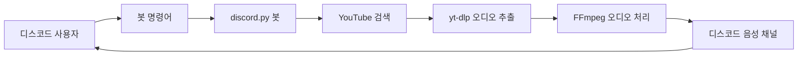
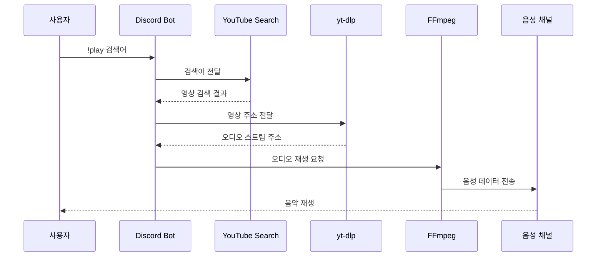

# Discord YouTube Music Bot

> Python으로 제작한 유튜브 음악 검색·재생 디스코드 봇

사용자가 입력한 노래 제목을 유튜브에서 검색하고, 검색 결과의 오디오를 디스코드 음성 채널에서 재생하는 음악 봇입니다.

`discord.py`를 이용해 디스코드 명령어와 음성 채널 연결을 처리하고, `youtubesearchpython`으로 영상을 검색한 뒤 `yt-dlp`와 FFmpeg를 이용해 오디오를 재생합니다.

---

## 프로젝트 개요

| 구분 | 내용 |
|---|---|
| 프로젝트명 | Discord YouTube Music Bot |
| 개발 언어 | Python |
| 프로젝트 분야 | 디스코드 봇, 음성 스트리밍 |
| 주요 기능 | 음성 채널 접속, 유튜브 음악 검색, 음악 재생·중지 |
| 디스코드 라이브러리 | discord.py |
| 영상 검색 | youtube-search-python |
| 오디오 추출 | yt-dlp |
| 오디오 재생 | FFmpeg |
| 실행 파일 | `my-bot-test.py` |

---

## 프로젝트 소개

디스코드 음성 채널에서 사용자가 원하는 음악을 간단한 명령어로 검색하고 재생할 수 있도록 제작한 봇입니다.

사용자가 노래 제목이나 검색어를 입력하면 유튜브 검색 결과를 조회하고, 해당 영상에서 오디오 주소를 추출해 디스코드 음성 채널로 전송합니다.

### 주요 동작

```text
사용자가 재생 명령어 입력
        ↓
유튜브에서 검색어 조회
        ↓
검색 결과의 영상 주소 확인
        ↓
yt-dlp로 오디오 정보 추출
        ↓
FFmpeg로 오디오 변환
        ↓
디스코드 음성 채널에서 재생
```

---

## 주요 기능

### 음성 채널 참여

사용자가 접속한 음성 채널에 봇을 연결합니다.

```text
!join
```

사용자가 음성 채널에 들어가 있는 상태에서 명령어를 입력해야 합니다.

---

### 음악 검색 및 재생

사용자가 입력한 검색어를 기준으로 유튜브에서 영상을 검색하고 음악을 재생합니다.

```text
!play 노래 제목
```

사용 예시:

```text
!play 아이유 좋은날
```

```text
!play aespa Supernova
```

---

### 음악 중지

현재 음성 채널에서 재생 중인 음악을 정지합니다.

```text
!stop
```

---

### 음성 채널 나가기

음악 재생을 종료하고 봇을 음성 채널에서 나가게 합니다.

```text
!leave
```

---

## 명령어

| 명령어 | 설명 | 사용 예시 |
|---|---|---|
| `!join` | 사용자가 접속한 음성 채널에 봇을 참여시킵니다. | `!join` |
| `!play [검색어]` | 유튜브에서 음악을 검색하고 재생합니다. | `!play 아이유 좋은날` |
| `!stop` | 현재 재생 중인 음악을 중지합니다. | `!stop` |
| `!leave` | 봇을 음성 채널에서 나가게 합니다. | `!leave` |

---

## 시스템 구조



---

## 음악 재생 처리 과정



---

## 사용 기술

### Python

봇 명령어 처리, 유튜브 검색, 오디오 정보 추출과 음성 재생 과정을 통합하는 데 사용했습니다.

### discord.py

- 디스코드 봇 생성
- 명령어 처리
- 사용자 음성 채널 확인
- 음성 채널 연결 및 종료
- 오디오 재생과 중지

### youtube-search-python

사용자가 입력한 노래 제목이나 검색어를 유튜브에서 검색하는 데 사용했습니다.

### yt-dlp

유튜브 영상에서 재생 가능한 오디오 스트림 정보를 추출하는 데 사용했습니다.

### FFmpeg

추출한 오디오 스트림을 디스코드 음성 채널에서 재생할 수 있는 형식으로 처리합니다.

---

## 저장소 구성

현재 저장소의 기존 구조를 변경하지 않고 사용합니다.

```text
discord-music-bot
├── my-bot-test.py
└── README.md
```

| 파일 | 설명 |
|---|---|
| [`my-bot-test.py`](./my-bot-test.py) | 디스코드 봇의 명령어, 유튜브 검색과 음악 재생 기능을 구현한 실행 파일 |
| [`README.md`](./README.md) | 프로젝트 소개 및 실행 방법 |

---

## 실행 환경

프로젝트를 실행하려면 다음 항목이 필요합니다.

- Python 3
- Discord 봇 토큰
- FFmpeg
- 디스코드 음성 채널
- 인터넷 연결

---

## 설치 방법

### 저장소 내려받기

```bash
git clone https://github.com/BAIKJUWON/discord-music-bot.git
cd discord-music-bot
```

### 가상환경 생성

```bash
python -m venv venv
```

### 가상환경 실행

#### Windows

```bash
venv\Scripts\activate
```

#### Linux 또는 macOS

```bash
source venv/bin/activate
```

---

## 라이브러리 설치

```bash
pip install discord.py yt-dlp youtube-search-python PyNaCl
```

각 라이브러리의 역할은 다음과 같습니다.

| 라이브러리 | 역할 |
|---|---|
| `discord.py` | 디스코드 봇과 명령어 처리 |
| `yt-dlp` | 유튜브 오디오 정보 추출 |
| `youtube-search-python` | 유튜브 검색 |
| `PyNaCl` | 디스코드 음성 연결 지원 |

---

## FFmpeg 설치

음악을 재생하려면 FFmpeg가 필요합니다.

### Windows

FFmpeg를 설치한 뒤 실행 파일이 있는 경로를 시스템 환경 변수 `PATH`에 추가합니다.

설치 확인:

```bash
ffmpeg -version
```

코드에서 FFmpeg의 절대 경로를 사용하는 경우 자신의 환경에 맞게 수정합니다.

```python
ffmpeg_path = "C:/ffmpeg/bin/ffmpeg.exe"
```

### Linux

```bash
sudo apt update
sudo apt install ffmpeg
```

### macOS

```bash
brew install ffmpeg
```

---

## 디스코드 봇 생성

1. Discord Developer Portal에서 새로운 응용프로그램을 생성합니다.
2. `Bot` 메뉴에서 봇을 추가합니다.
3. 봇 토큰을 발급받습니다.
4. 필요한 인텐트를 활성화합니다.
5. OAuth2 URL을 생성하여 봇을 서버에 초대합니다.
6. 봇에 음성 채널 연결과 발언 권한을 부여합니다.

### 필요한 권한

- 메시지 보기
- 메시지 보내기
- 음성 채널 연결
- 음성 채널에서 발언
- 명령어 사용

---

## 봇 토큰 설정

봇 토큰은 GitHub 저장소에 직접 작성하면 안 됩니다.

다음과 같이 환경 변수로 관리하는 것을 권장합니다.

### 환경 변수 등록

#### Windows PowerShell

```powershell
$env:DISCORD_BOT_TOKEN="발급받은_봇_토큰"
```

#### Linux 또는 macOS

```bash
export DISCORD_BOT_TOKEN="발급받은_봇_토큰"
```

### Python에서 환경 변수 불러오기

```python
import os

token = os.getenv("DISCORD_BOT_TOKEN")

if token is None:
    raise ValueError("DISCORD_BOT_TOKEN 환경 변수가 설정되지 않았습니다.")

bot.run(token)
```

---

## 실행 방법

```bash
python my-bot-test.py
```

봇이 정상적으로 실행되면 디스코드 서버에서 온라인 상태로 표시됩니다.

음성 채널에 접속한 뒤 다음과 같이 사용합니다.

```text
!join
!play 노래 제목
!stop
!leave
```

---

## 실행 전 확인사항

### 봇이 음성 채널에 들어오지 않는 경우

- 사용자가 먼저 음성 채널에 접속했는지 확인
- 봇의 음성 채널 연결 권한 확인
- `PyNaCl` 설치 여부 확인

### 음악이 재생되지 않는 경우

- FFmpeg 설치 여부 확인
- FFmpeg 경로 확인
- `yt-dlp` 최신 버전 설치
- 봇의 음성 채널 발언 권한 확인

`yt-dlp` 업데이트:

```bash
pip install --upgrade yt-dlp
```

### 명령어가 작동하지 않는 경우

- 명령어 접두사가 `!`로 설정되어 있는지 확인
- 메시지 내용 인텐트가 활성화되어 있는지 확인
- Discord Developer Portal의 봇 설정 확인

---

## 구현 결과

- 디스코드 봇 음성 채널 연결
- 음성 채널 연결 해제
- 유튜브 검색어 기반 영상 검색
- yt-dlp 기반 오디오 주소 추출
- FFmpeg 기반 음성 재생
- 현재 음악 재생 중지
- 명령어 기반 봇 제어

---

## 프로젝트를 통해 얻은 경험

- Python 비동기 프로그래밍
- discord.py 명령어 처리
- 디스코드 음성 채널 연결
- 유튜브 검색 결과 처리
- yt-dlp를 이용한 미디어 정보 추출
- FFmpeg를 이용한 오디오 스트리밍
- 외부 프로그램과 Python 연동
- 봇 토큰과 환경 변수 관리
- 음성 재생 오류 확인과 디버깅

---

## 기술적 회고

### 잘된 점

- 검색어만 입력해 유튜브 음악을 바로 재생할 수 있도록 구현했습니다.
- 디스코드 명령어와 음성 채널 기능을 연결했습니다.
- 유튜브 검색, 오디오 추출과 음성 재생 기능을 하나의 프로그램으로 통합했습니다.
- 기본적인 음악 봇 제어 명령어를 구현했습니다.
- 외부 라이브러리와 FFmpeg를 연동하는 경험을 쌓았습니다.

### 개선할 점

- 여러 곡을 저장할 수 있는 재생 대기열 추가
- 일시정지와 다시 재생 명령어 추가
- 다음 곡과 이전 곡 기능 추가
- 반복 재생 기능 추가
- 현재 재생 중인 곡 정보 표시
- 검색 결과 여러 개를 보여주는 선택 기능
- 음악이 끝난 후 다음 곡 자동 재생
- 명령어 예외 처리 강화
- 음성 연결이 끊겼을 때 자동 재연결
- 사용자별 명령어 권한 설정
- 접두사 명령어를 슬래시 명령어로 변경
- 봇 토큰과 설정값을 `.env` 파일로 관리
- 기능별 파일과 클래스로 코드 분리

---

## 보안 주의사항

다음 정보는 공개 저장소에 올리면 안 됩니다.

- 디스코드 봇 토큰
- 서버 인증정보
- 개인 계정 정보
- 로컬 컴퓨터의 민감한 경로

`.gitignore` 파일에는 다음 내용을 추가하는 것이 좋습니다.

```gitignore
.env
venv/
__pycache__/
*.pyc
```

토큰이 GitHub에 한 번이라도 공개되었다면 단순히 코드에서 삭제하는 것만으로는 부족합니다. 기존 토큰을 폐기하고 Discord Developer Portal에서 새로운 토큰을 발급받아야 합니다.

---

## 관련 링크

- [봇 소스 코드](./my-bot-test.py)
- [GitHub 저장소](https://github.com/BAIKJUWON/discord-music-bot)
